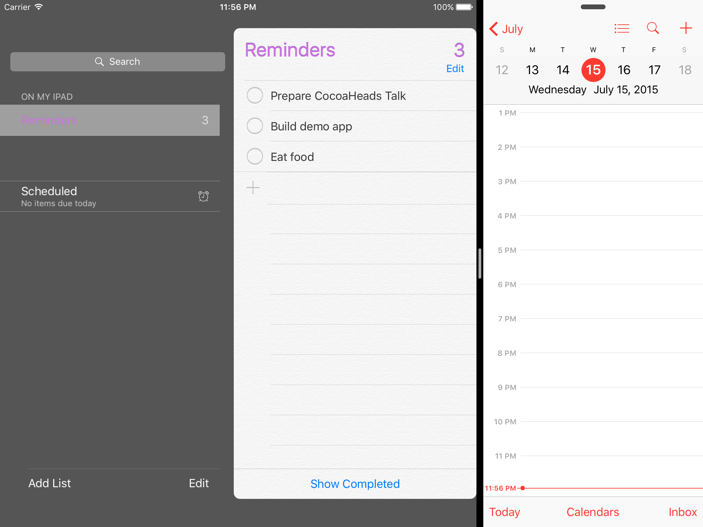

# Multitasking and Adaptive Apps

---

# "Adaptive apps"

^ I want to expand your vision of what this means


---

## UISplitViewController, right?
---

# UISplitViewController

- Dual-pane when wide
- Single-pane when narrow

---



---


---

# What else?

---


^ Consider the left pane here

---


`[self.navigationController pushViewController:]`


---


^ This is what it looks like expanded


---

### `[self.navigationController` <br><br> `pushViewController:]`

## becomes

### `[nil pushViewController:]`

^ Your view controller broke because of a change in its containers.

---


```objc


switch traitCollection.horizontalSizeClass {

  case .Compact:
    self.navigationController?.pushViewController(vc)

  case .Regular:
    self.presentViewController(vc, animated: true, completion: nil)

}
```

^ Now we have this conditional code everywhere.

^ We're *still* depending on the container.

---

# 😧

---

## Adaptivity is *not* just <br> about UISplitViewController

---

# Adaptivity decouples *controllers*
## and
# *context*

---


# Navigation controller

```objc

// Don't do this:
[self.navigationController pushViewController:vc]


// do this:
[self showViewController:vc sender: self]
```

---


# Split view controller

```objc

// Don't do this:
self.splitViewController.viewControllers[1] = vc;


// do this:
[self showDetailViewController:vc sender: self]
```

---

# How does this work?

---


1. Does `self` define *`showDetailViewController:`*?
2. Does some parent controller define *`showDetailViewController:`*?
3. Does `parentViewController.parentViewController` define it?
4. ... etc ...
5. Else, *`presentViewController:`*


---


How `UISplitViewController` implements *`showDetailViewController:`*

1. If !collapsed: show in the detail pane
2. If collapsed, call *`showViewController:`* on master pane
3. Else, *`presentViewController:`*


---

# SplitViewController


```objc
extension UIViewController {
  func showDetailViewController(vc: UIViewController, sender: AnyObject?) {
    if let target =
      targetViewControllerForAction("showDetailViewController:sender:", sender: nil)
    {
      target.showDetailViewController(vc, sender:sender)
    }
    else {
      presentViewController(vc, animated: true, completion: nil)
    }
}
```

---


```objc
extension UISplitViewController {
  override func showDetailViewController(vc: UIViewController, sender: AnyObject?) {
    // If expanded, show in the detail pane
    if collapsed == false {
      self.viewControllers[1] = vc
      return
    }

    // If collapsed, try 'showViewController' on the master
    if let masterVC = self.viewControllers[0],
       let target = masterVC.targetViewControllerForAction("showViewController:sender:")
    {
      target.showViewController(vc, sender: sender)
    }

    else { // Present modal
      self.presentViewController(vc, animated: true, completion: nil)
    }
  }
}
```

---

## What if you need something else?

---

### *I'm out of slides.*
### *Let's demo.*
